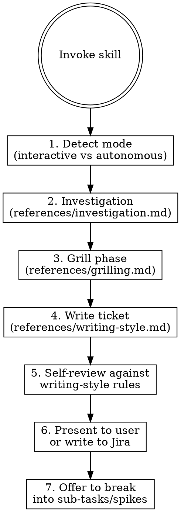

# Writing Tickets

Write clear, actionable tickets grounded in actual codebase investigation. Produces output readable by PMs and actionable by engineers.

**Announce at start:** "Using writing-tickets to [write/rewrite] [ticket type] for [topic]."

## Inputs

Extract from the user's message:
- **Ticket type:** initiative, epic, story, spike, or rewrite of existing ticket
- **Topic or ticket key:** what to write about, or existing ticket to rewrite
- **Mode:** `--autonomous` (no user input, self-grills, runs to completion) or interactive (default)
- **Output:** `--direct` (write to Jira without previewing) or present-first (default)
- **Scope:** `--with-subtasks` (also break into child tickets after approval)

If ticket type is ambiguous, ask: "Should I write just the [epic/story], or also break it into sub-tasks?"

## Flow

### Phase 1: Detect Mode

- **Interactive (default):** Ask questions, present drafts, wait for approval
- **Autonomous (`--autonomous`):** Self-grill, self-answer via investigation, run to completion. See [references/autonomous.md](references/autonomous.md)
- **Direct (`--direct`):** Skip preview, write to Jira immediately after internal review

### Phase 2: Investigation

Adaptive depth by ticket type. Always check related tickets/PRs/docs. See [references/investigation.md](references/investigation.md).

| Ticket Type | Codebase Depth | Related Context |
|-------------|---------------|-----------------|
| Initiative | Shallow -- architecture overview | Always: tickets, PRs, docs, Confluence |
| Epic | Medium -- trace key call paths, read key files | Always: tickets, PRs, docs, Confluence |
| Story | Deep -- map models, interactors, controllers, tests | Always: tickets, PRs, docs, Confluence |
| Spike | Medium -- enough to frame what's unknown | Always: tickets, PRs, docs, Confluence |
| Rewrite | Match original ticket type depth | Always: tickets, PRs, docs, Confluence |

### Phase 3: Grill

Calibrated Q&A by ticket type. See [references/grilling.md](references/grilling.md).

### Phase 4: Write

Apply writing style rules. See [references/writing-style.md](references/writing-style.md).

### Phase 5: Self-Review

Before presenting, verify:
- [ ] Problem statement leads, not solution
- [ ] Key results / end state defined
- [ ] Situated in hierarchy (parent initiative/epic, sibling tickets, dependencies)
- [ ] Related tickets, PRs, docs linked
- [ ] No hallucinated file paths, method names, or model relationships
- [ ] Acceptance criteria are non-redundant and testable
- [ ] Unresolved questions explicit with numbered list
- [ ] Spike tickets drafted for unknowns neither user nor investigation could resolve
- [ ] No section overlap: stories/tasks must NOT have an "In scope" section (that content belongs in "Desired behavior" + "Technical approach"). Use "Out of scope" for guardrails only.

### Phase 6: Output

**Default:** Present the draft in conversation. Ask: "Want me to create/update this in Jira?"
**`--direct`:** Write to Jira without previewing.
**Jira unavailable:** Present in conversation only. Note that Jira was unavailable.

### Phase 7: Sub-Tasks

For epics and initiatives, after the parent ticket is approved:
- Offer to break into stories and/or spike tickets
- Each sub-task goes through phases 2-6 at its own depth level
- Spike tickets get minimal investigation (they exist to find answers)

## Unknowns Handling

1. **Ask the user first** (interactive mode only)
2. If the user doesn't know: **flag in the ticket** under "Unresolved Questions"
3. If the unknown needs hands-on investigation: **draft a spike ticket** with clear experiment criteria
4. **Autonomous mode:** log assumption with confidence level (High/Medium/Low), surface all assumptions in a dedicated section

## Graceful Degradation

| Tool | Available | Unavailable |
|------|-----------|-------------|
| Jira MCP | Read linked tickets, search related, write output | Skip Jira context, present in conversation only |
| GitHub | Search PRs, read commit history, check code | Use local git history only |
| Confluence MCP | Search related docs, read pages | Skip doc context, note it was unavailable |
| Datadog MCP | Search logs, metrics, monitors, traces | Skip observability context, note it was unavailable |
| Codebase index | Query graph, search code | Fall back to Grep/Glob/Read |

Never fail because a tool is unavailable. Degrade gracefully, note what was skipped.

## Sub-Agent Usage

**Always use sub-agents for investigation**, regardless of mode. This keeps the orchestrator's context lean.

| Agent | Model | Purpose |
|-------|-------|---------|
| Codebase investigator | sonnet | File paths, call paths, model relationships, test coverage |
| Ticket/PR researcher | sonnet | Related tickets, PR history, Confluence docs |
| Domain deep-dive | opus | Complex architectural questions, cross-cutting concerns |
| Spike scoper | sonnet | Frame unknowns, draft experiment criteria |

**Rules:**
- Sub-agents do NOT spawn their own sub-agents (two-level only)
- Max 3 concurrent sub-agents
- Each sub-agent gets explicit instructions and returns structured findings
- Orchestrator synthesizes findings, never delegates writing the final ticket

## After Grooming

When invoked after `ticket-grooming`, the grooming output is available in conversation. Use it:
- Grooming findings become investigation inputs (don't re-investigate what grooming already found)
- Grooming gaps become grill-me questions
- Grooming risk flags become acceptance criteria

## Reference Files

| File | Contents |
|------|----------|
| [references/investigation.md](references/investigation.md) | Investigation phase details: what to check at each depth level, sub-agent prompts |
| [references/grilling.md](references/grilling.md) | Embedded grill-me phase: question sets by ticket type, self-grill for autonomous mode |
| [references/writing-style.md](references/writing-style.md) | Writing style rules, section templates by ticket type, examples |
| [references/autonomous.md](references/autonomous.md) | Autonomous mode: self-grilling, assumption logging, confidence levels |
